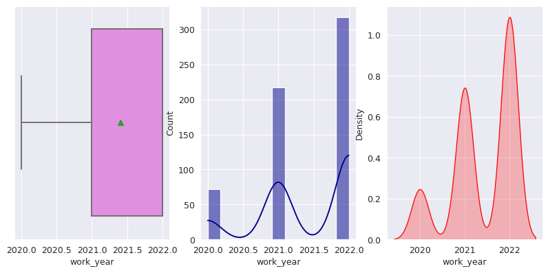
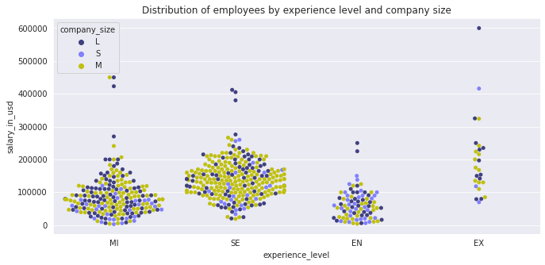
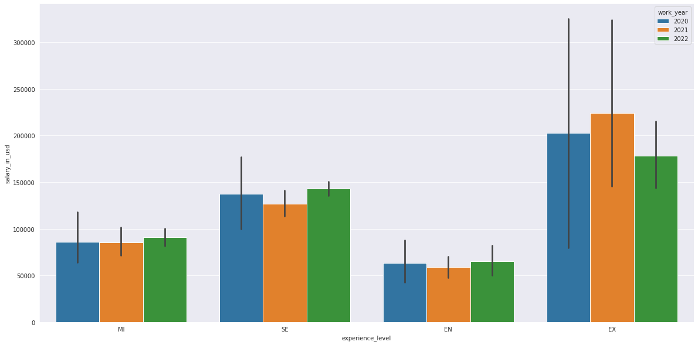
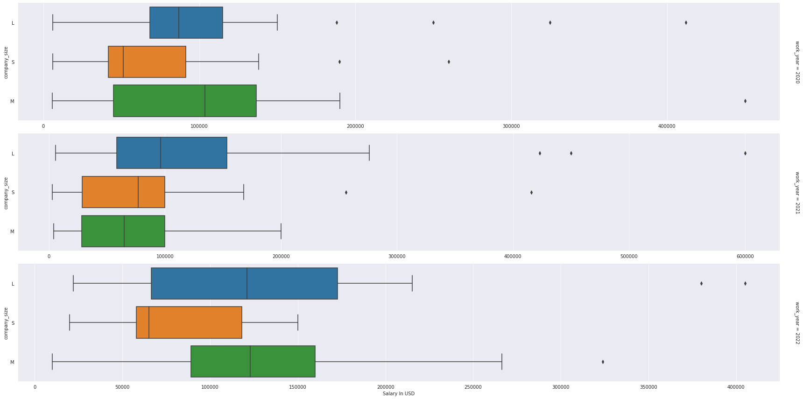
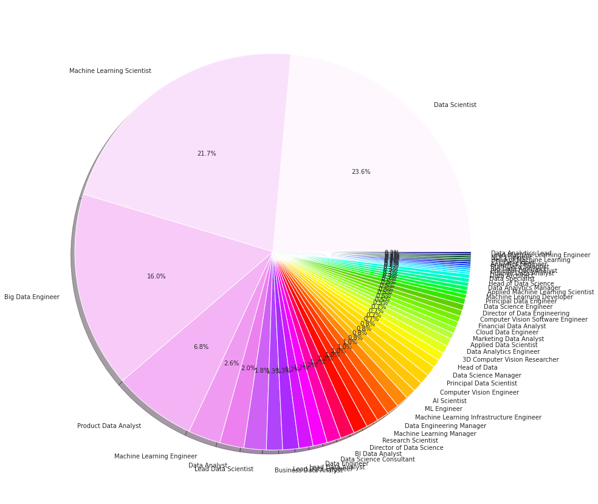

# `Deep-Data-Analysis-Project`

## `1- Packiges & Tools`
<!--Packiges-&-Tools-->
```mermaid
graph TD;
    Packiges-&-Tools-->1-Python;
    Packiges-&-Tools-->2-Analytical-Tools;
    Packiges-&-Tools-->3-Seaborn;
    Packiges-&-Tools-->4-Plotly-Express;
    Packiges-&-Tools-->5-Colab-Kaggle;
    Packiges-&-Tools-->6-And-Other;
   ```

## `2- Images About Data Analysis Process`

1.


2.


3.


4.


5.



## `3- Insights That I Got From My Analysis`
1- There are fewer experts in small companies.

2- High salaries are more common in large companies:
- which is logical as they tend to invest in experienced professionals to achieve accurate results and increase profits.

3- There is a high degree of similarity between the locations of companies and the residences of their employees:
- which is understandable as most employees prefer to work close to where they live.

4- And more...
.

## `4- Author`
- [Mohammed``` Shaeerah 𝞹📈🧠📚](https://github.com/Mo-Shaeerah)
